# Azure DevOps CI/CD Automation

Docker | Azure DevOps | CI/CD Pipelines | Container Deployment Automation

Enterprise Azure DevOps CI/CD automation project using Docker, Nginx, YAML pipelines, monitoring, and deployment automation.

---

# 🚀 Project Overview

This project demonstrates an end-to-end CI/CD automation workflow using Azure DevOps Pipelines, Docker containerization, and Nginx deployment.

The solution automates:
- Source code integration
- Docker image build process
- Container deployment
- Deployment validation
- Monitoring and logging

This project highlights DevOps automation, Infrastructure as Code concepts, CI/CD best practices, and containerized application deployment workflows.

---

## Table of Contents

- [Project Overview](#-project-overview)
- [Architecture Diagram](#️-architecture-diagram)
- [Technologies Used](#️-technologies-used)
- [Features](#-features)
- [Project Structure](#-project-structure)
- [CI/CD Workflow](#-cicd-workflow)
- [Project Screenshots](#-project-screenshots)
- [Deployment Steps](#-deployment-steps)
- [Security Best Practices](#-security-best-practices)
- [Future Enhancements](#-future-enhancements)
- [Cleanup](#-cleanup)
- [Author](#-author)

---

# 🏗️ Architecture Diagram

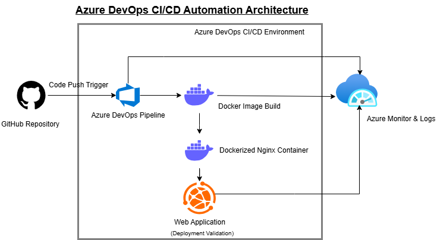

This architecture illustrates the complete CI/CD workflow from GitHub source integration to Azure DevOps pipeline automation, Docker containerization, deployment validation, and monitoring.

---

# ⚙️ Technologies Used

- Azure DevOps
- YAML Pipelines
- Docker
- Nginx
- GitHub
- Linux
- HTML/CSS
- CI/CD Automation
- Containerization
- DevOps
- Infrastructure Automation

---

# ☁️ Azure Services Used

- Azure DevOps
- Azure Container Registry (ACR)
- Azure App Service
- Azure Deployment Center
- Azure Monitoring & Logs

---

# ✨ Features

- Automated CI/CD pipeline
- Docker image build automation
- Containerized Nginx deployment
- GitHub integration
- YAML pipeline configuration
- Deployment validation
- Monitoring and logs collection
- DevOps workflow automation
- Reusable YAML-based CI/CD pipelines

---

# 📁 Project Structure

```text
azure-devops-ci-cd-automation/
│
├── architecture/
│   ├── azure-devops-architecture.png
│   └── README.md
│
├── screenshots/
│
├── logs/
│
├── Dockerfile
├── azure-pipelines.yml
├── nginx.conf
├── index.html
├── style.css
├── README.md
└── .gitignore
```


# 🔄 CI/CD Workflow

1. Developer pushes code to GitHub repository
2. Azure DevOps pipeline gets triggered
3. Docker image build process starts
4. Nginx container deployment is executed
5. Application deployment validation is performed
6. Monitoring and logs are generated

---

# 📸 Project Screenshots

## Azure Resource Group
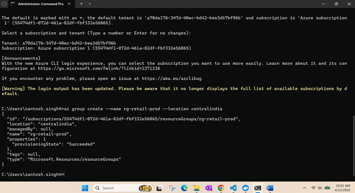

---

## Azure Container Registry
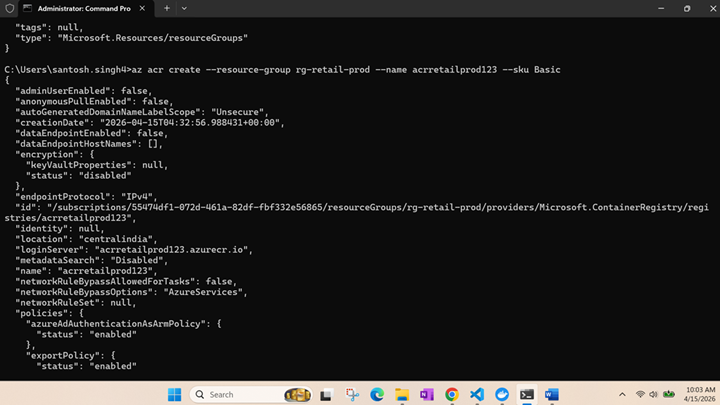

---

## Application Source Code
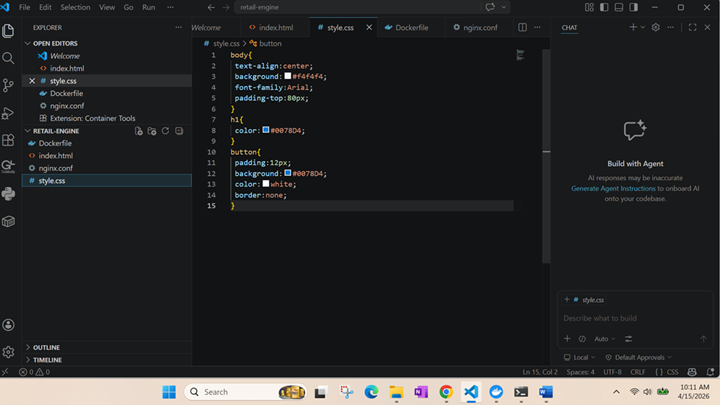

---

## Dockerfile Configuration
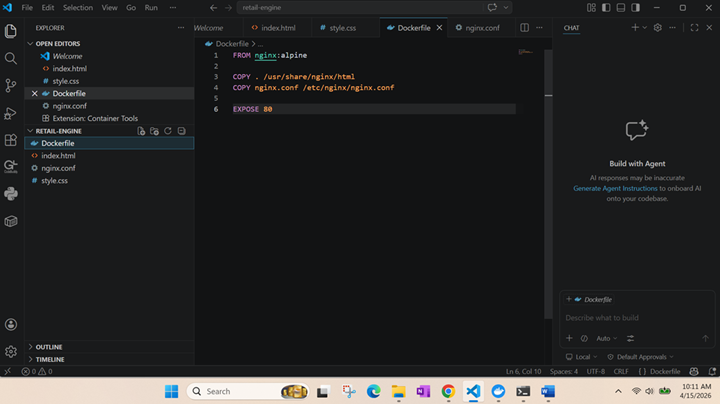

---

## Docker Image Build
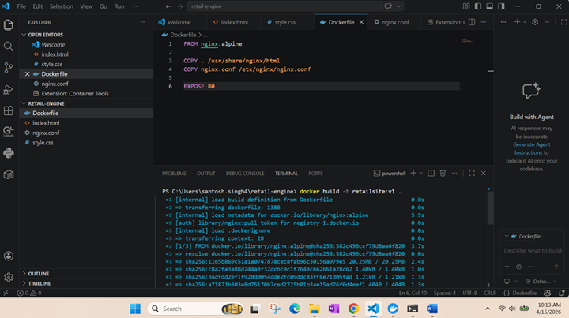

---

## Docker Container Execution
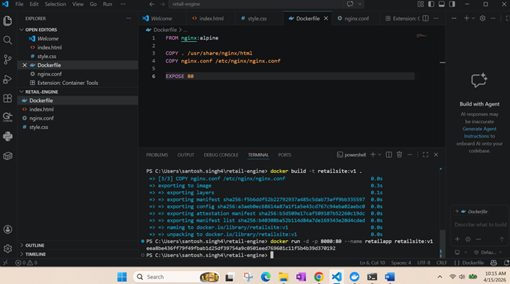

---

## Local Deployment Validation
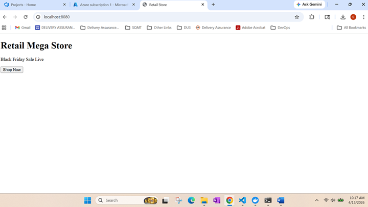

---

## Docker Image Push to ACR
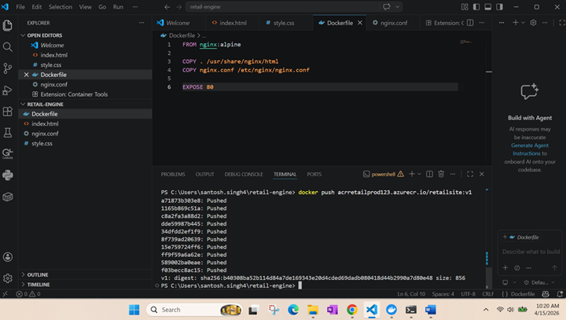

---

## Azure App Service
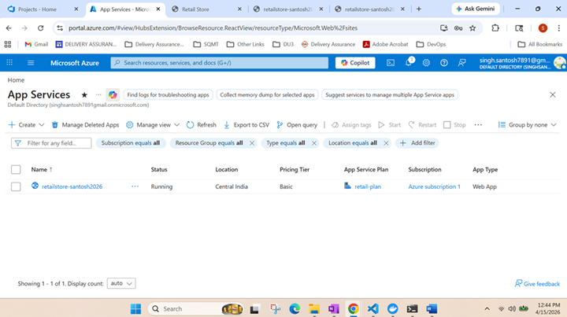

---

## Azure Web App Overview
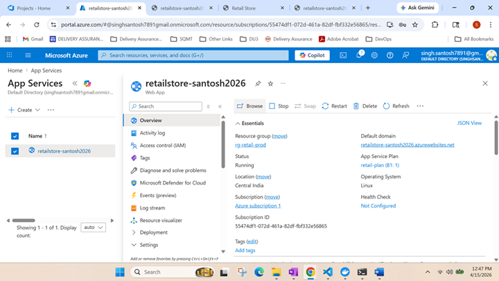

---

## Live Application Deployment

Successful deployment validation of containerized web application through Azure App Service.

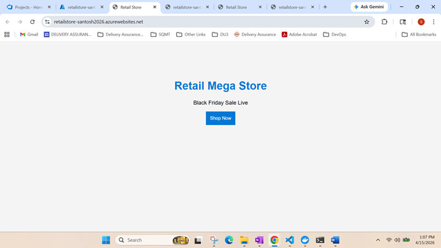

---

## Deployment Slots
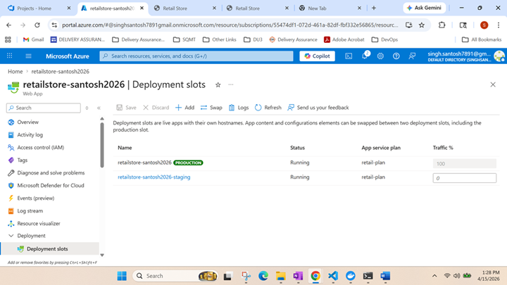

---

## Deployment Center Configuration
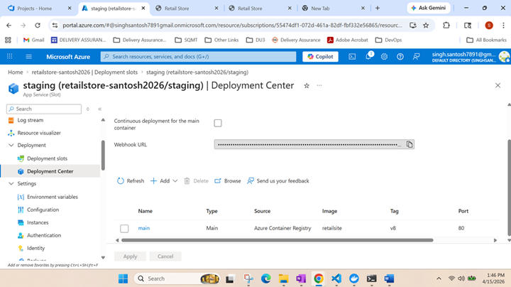
---

## Monitoring & Logs


---

# 📦 Pipeline Components

- GitHub Repository Integration
- Azure DevOps YAML Pipeline
- Docker Image Build & Tagging
- Azure Container Registry (ACR)
- Azure App Service Deployment
- Deployment Validation
- Monitoring & Logs

---
# 📄 Sample Azure DevOps Pipeline

```yaml
trigger:
- main

pool:
  vmImage: ubuntu-latest

steps:
- script: docker build -t nginx-webapp .
  displayName: Build Docker Image
```

# 🚀 Deployment Steps

## Clone Repository

```bash
git clone https://github.com/santoshsingh7891/azure-devops-ci-cd-automation.git
```

## Build Docker Image

```bash
docker build -t nginx-webapp .
```

## Run Docker Container

```bash
docker run -d -p 80:80 nginx-webapp
```

---

# 🔐 Security Best Practices

- Secure CI/CD pipeline configuration
- Containerized deployment isolation
- Git-based version control
- Automated deployment validation
- Monitoring and operational logging

---

# 📈 Future Enhancements

- Kubernetes deployment integration
- Azure Kubernetes Service (AKS)
- Terraform automation
- SonarQube code quality analysis
- Prometheus & Grafana monitoring
- Multi-stage Docker builds
- GitHub Actions integration

---

# 🧹 Cleanup

```bash
docker stop <container_id>
docker rm <container_id>
docker rmi nginx-webapp
```

---

# 👨‍💻 Author

Santosh Singh  
Cloud & DevOps Engineer

---

# 🔗 Connect With Me

- LinkedIn: https://www.linkedin.com/in/santosh-singh-141a5775/
- GitHub: https://github.com/santoshsingh7891
  
⭐ If you found this project useful, feel free to star the repository.
